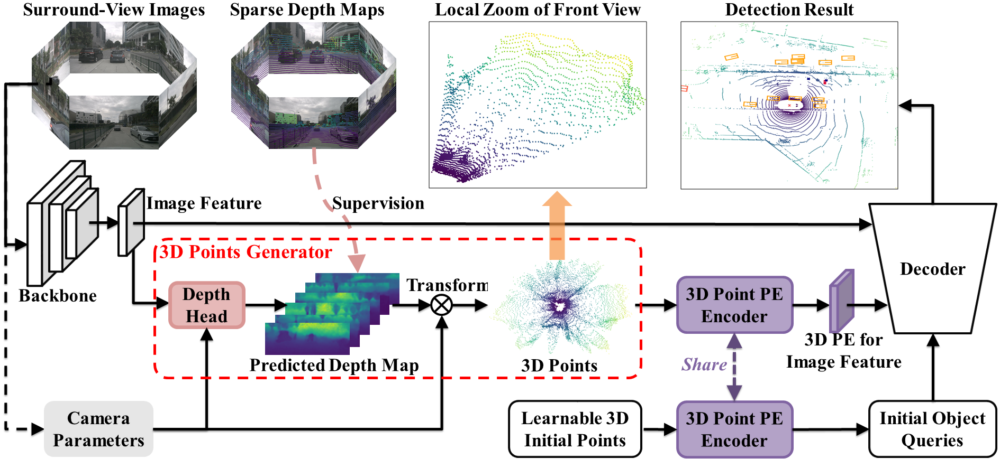

# (ICCV2023) 3DPPE: 3D Point Positional Encoding for Multi-Camera 3D Object Detection Transformers
<!-- ## Introduction -->

This repository is an official implementation of [3DPPE](https://arxiv.org/abs/2211.14710) 
And we also extand the 3DPPE on streamPETR, please refer to .

<div align="center">
  
</div><br/>

Transformer-based methods have swept the benchmarks on 2D and 3D detection on images. Because tokenization before the attention mechanism drops the spatial information, positional encoding becomes critical for those methods. Recent works found that encodings based on samples of the 3D viewing rays can significantly improve the quality of multi-camera 3D object detection. We hypothesize that 3D point locations can provide more information than rays. Therefore, we introduce 3D point positional encoding, 3DPPE, to the 3D detection Transformer decoder. Although 3D measurements are not available at the inference time of monocular 3D object detection, 3DPPE uses predicted depth to approximate the real point positions. Our hybriddepth module combines direct and categorical depth to estimate the refined depth of each pixel. Despite the approximation, 3DPPE achieves 46.0 mAP and 51.4 NDS on the competitive nuScenes dataset, significantly outperforming encodings based on ray samples.  

## Preparation
This implementation is built upon [detr3d](https://github.com/WangYueFt/detr3d/blob/main/README.md), and can be constructed as the [install.md](./install.md).

* Environments  
  Linux, Python==3.8.5, CUDA == 11.1, pytorch == 1.8.2, mmdet3d == 1.0.0rc3+5de6898   

* Detection Data   
Follow the mmdet3d to process the nuScenes dataset (https://github.com/open-mmlab/mmdetection3d/blob/master/docs/en/data_preparation.md).


* Pretrained weights   
To verify the performance on the val set, we provide the pretrained V2-99 [weights](https://drive.google.com/file/d/1ABI5BoQCkCkP4B0pO5KBJ3Ni0tei0gZi/view?usp=sharing). The V2-99 is pretrained on DDAD15M ([weights](https://tri-ml-public.s3.amazonaws.com/github/dd3d/pretrained/depth_pretrained_v99-3jlw0p36-20210423_010520-model_final-remapped.pth)) and further trained on nuScenes **train set** with FCOS3D.  For the results on test set in the paper, we use the DD3D pretrained [weights](https://drive.google.com/drive/folders/1h5bDg7Oh9hKvkFL-dRhu5-ahrEp2lRNN). The ImageNet pretrained weights of other backbone can be found [here](https://github.com/open-mmlab/mmcv/blob/master/mmcv/model_zoo/open_mmlab.json).
Please put the pretrained weights into ./ckpts/. 

* After preparation, you will be able to see the following directory structure:  
  ```
  3DPPE
  ├── mmdetection3d
  ├── projects
  │   ├── configs
  │   ├── mmdet3d_plugin
  ├── tools
  ├── data
  │   ├── nuscenes
  │     ├── HDmaps-nocover
  │     ├── ...
  ├── ckpts
  ├── README.md
  ```

## Main Results

| config            | mAP      | NDS     |training    |   config |   download |
|:--------:|:----------:|:---------:|:--------:|:--------:|:-------------:|
| PETR-vov-p4-800x320 (PETR's)   | 37.8%     | 42.6%    | 17hours  | [config](projects/configs/petr/petr_vovnet_gridmask_p4_800x320.py)   |   [log](https://drive.google.com/file/d/1eG914jDVK3YXvbubR8VUjP2NnzYpDvHC/view?usp=sharing) / [gdrive](https://drive.google.com/file/d/1-afU8MhAf92dneOIbhoVxl_b72IAWOEJ/view?usp=sharing)        |
| petr_depth_3dpe_dfl_vovnet_wogridmask_p4_800x320 (Ours)   | 39.8%     | 44.6%    | 15hours  | [config](projects/configs/petr_depth/petr_depth_3dpe_dfl_vovnet_wogridmask_p4_800x320_pdg.py)  |   [log](https://drive.google.com/file/d/111s8kTUYABoe-OvDVf0K_TrDR6JtQeHG/view?usp=sharing) / [gdrive](https://drive.google.com/file/d/1reVRYPWlfofKrutvY8WTX9eO_l8uKRBW/view?usp=sharing)     |
| PETRv2-vov-p4-800x320 (PETR's)   | 41.0%     | 50.3%    | 30hours  | [config](projects/configs/petrv2/petrv2_vovnet_gridmask_p4_800x320.py)  | [log](https://drive.google.com/file/d/1QcVSDHoUAcFLqziwZrBn5A2oAjH86WiO/view?usp=sharing) / [gdrive](https://drive.google.com/file/d/1tv_D8Ahp9tz5n4pFp4a64k-IrUZPu5Im/view?usp=sharing)    
| petrv2_depth_3dpe_dfl_vovnet_wogridmask_p4_800x320 (Ours)   | 43.2%     | 51.9%    | 27hours  | [config](projects/configs/petrv2_depth/petrv2_depth_3dpe_dfl_vovnet_wogridmask_p4_800x320_pdg.py)  |   [log](https://drive.google.com/file/d/1l1gDYek6twVGb0XySMydbFqh32TthZuo/view?usp=sharing) / [gdrive](https://drive.google.com/file/d/1hJLwE-9EG0H8UoB1DYkpwarJPdRd9NNe/view?usp=sharing)     |
| petr_depth_gtpe_r50dcn_gridmask_c5 (Ours)   | 39.98%     | 40.92%    | 28hours  | [config](projects/configs/petr_depth/petr_depth_gtpe_r50dcn_gridmask_c5.py)  |   [log](https://drive.google.com/file/d/1UQ6ZJ2oj5R7wuD7XsTzZbPhWKYMRoSW2/view?usp=sharing) / [gdrive](https://drive.google.com/file/d/1hpXr6HSG0Q1YUL1g0_RD-t4Jiomi1CE1/view?usp=share_link)     |


## Acknowledgement
Many thanks to the authors of [PETR](https://github.com/megvii-research/PETR), and the main code is based on it.


## Citation
If you find this project useful for your research, please consider citing: 
```bibtex   
@article{shu20233DPPE,
  title={3DPPE: 3D Point Positional Encoding for Multi-Camera 3D Object Detection Transformers},
  author={Shu, Changyong and Deng, Jiajun and Yu, Fisher and Liu, Yifan},
  journal={arXiv preprint arXiv:2211.14710},
  year={2023}
}
```

